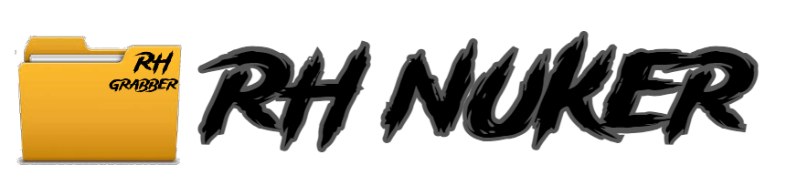

# How TO USE
 
 <div id="top"></div>
<p align="center">
  <a href="https://github.com/othneildrew/Best-README-Template">
    
  </a>


 ```Form Scrach ```
1: ```Download python 3.9 To Your path```

2: ```Turn Off Your antivirus And Download The Just Src You Dont Need AnyThing Else```

3: ```pip install -r requirements.txt Or Run The requirements.bat ```

4: ```Now Run The RH NUKER.py With Python ```

<p align="right">(<a href="#top">back to top</a>)</p>


```The easy Way ```

1: ```pip install -r requirements.txt Or Run The requirements.bat```

2:```Open The RH NUKER.exe And Your Done```

<p align="right">(<a href="#top">back to top</a>)</p>


 ```how-to-create-bot-account ```

1: ```Go to https://discord.com/developers/ ```

2: ```Open a new application ```

3: ```Put a name for the application ```

4: ```Now go to the Bot sub-part ```

5: ```Click on Add Bot and confirm ```

6: ```Give your bot the permissions it requires ```

7: ```Now go to OAuth2 sub-part ```

8: ```In the Scopes under OAuth2 URL Generator, click the checkbox beside bot, give it the permissions it requires by scrolling down and copy the url generated. ```

9: ```Copy the link generated and paste it in the Redirects section. ```

10: ```Click on the Select Redirect URL and click on the first option. ```

11: ```Go to the Bot sub-part and copy the bot token. ```

<p align="right">(<a href="#top">back to top</a>)</p>

